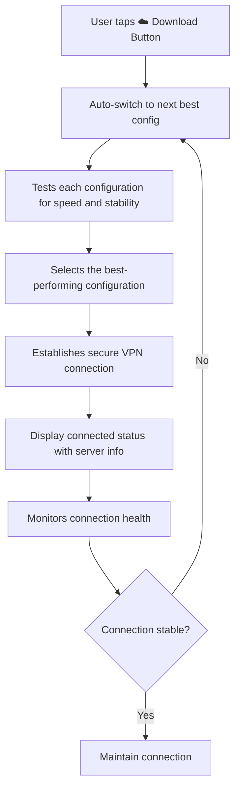

🌟 Hamed VPN | VPN حـــامد

<p align="center">
  
  
  
  
  
  
  
  
</p>

---

🌐 Language Selection | انتخاب زبان

.**[🇬🇧 English](https://github.com/hamedp-71/HamedVPN/blob/main/README.md)**
.**[ 🇮🇷 فارسی](https://github.com/hamedp-71/hamedvpn/blob/main/ReadmeFa.md)**


</details>

---

🇬🇧 English

🚀 Welcome to Hamed VPN

Hamed VPN is a powerful and intelligent Android VPN client based on V2RayNG, designed specifically for users in countries with restricted internet access, such as Iran. It provides seamless, secure, and automated connectivity to the free internet using advanced proxy technologies.

---

✨ Key Features

Feature Description
🤖 Smart Auto-Connect Automatically fetches, tests, and connects to the best available configuration for optimal performance and stability.
⚡ One-Tap Connect Simply tap the cloud-shaped download button on the main screen to initiate the intelligent connection process.
🔐 Advanced Security Built on the robust V2Ray/Xray cores with support for VMess, VLESS, Trojan, and Shadowsocks protocols.
🌍 Optimized for Iran Specifically fine-tuned to bypass deep packet inspection (DPI) and network restrictions in the region.
🧠 Smart Core The intelligent core extracts and tests multiple configurations, automatically switching to the fastest and most reliable connection.
📱 User-Friendly Interface Clean, modern, and intuitive design for both beginners and advanced users.
🔄 Auto-Update Built-in updater for geoip.dat and geosite.dat from trusted sources to ensure accurate routing.
🛡️ Privacy First No logs, no tracking, and full encryption to protect your digital footprint.
📶 Seamless Switching Automatically switches between configurations if the current connection drops or becomes unstable.
🏎️ High Performance Optimized for speed and low latency, ensuring a smooth browsing experience.
🔒 GPG Verified All releases are cryptographically signed to guarantee authenticity and integrity.

---

📥 Download & Installation

🔽 Download Latest Version

Get the Hamed VPN v1.0.0 Stable release from our official GitHub repository:

<p align="center">
  <a href="https://github.com/hamedp-71/HamedVPN/releases/tag/v1.0.0">
    
  </a>
</p>

📱 Installation Guide

1. Download the latest APK from the link above.
2. Enable "Install from Unknown Sources" in your device settings.
3. Install the APK on your Android device (API 24+).
4. Open the app and grant necessary permissions (VPN and notifications).
5. Tap the ☁️ cloud-shaped download button to start the smart auto-connect process.
6. Wait for the intelligent core to fetch, test, and connect to the best configuration.
7. Enjoy unrestricted, fast, and secure internet access!

---

🧠 How the Smart Auto-Connect Works

The intelligent core of Hamed VPN revolutionizes the way you connect to the internet:



🎯 Why It's Revolutionary

· No Manual Setup: You don't need to enter server addresses, ports, or UUIDs manually.
· Intelligent Testing: The core automatically ping-tests multiple configurations and selects the one with the lowest latency and highest throughput.
· Self-Healing: If the current connection fails, the system automatically switches to a backup configuration without interruption.
· Optimized for Iran: The configurations are specifically tailored to bypass Iranian network restrictions effectively.

---

🌍 Geoip & Geosite Configuration

📍 File Location

geoip.dat and geosite.dat are stored in:

```
Android/data/com.v2ray.ang/files/assets
```

⚡ Auto-Update Feature

The built-in downloader fetches enhanced rule sets from trusted repositories:

· Loyalsoldier/v2ray-rules-dat

[!CAUTION]
Auto-update requires an active proxy connection.

📂 Manual Import

You can manually import the latest official datasets:

· Domain List (Geosite)
· IP List (Geoip)

🔧 Third-party Support

Custom .dat files can be placed in the same directory for specialized routing rules.

---

🛠️ Development Guide

📱 Building the Android App

The Android project can be built using:

· Android Studio (Recommended)
· Gradle Wrapper (Command Line)

[!WARNING]
The bundled v2ray core in the AAR may be outdated. It's recommended to compile a fresh core.

⚙️ Compiling the Core (AAR)

To generate an updated AAR, compile from these GoLang projects:

· AndroidLibV2rayLite
· AndroidLibXrayLite

Quickstart Resources:

· Go Mobile Guide
· Makefiles for Go Developers

🖥️ Running on Emulators & WSA

· Android Emulators: Works perfectly on all standard Android emulators.
· Windows Subsystem for Android (WSA):
  Grant VPN permissions via ADB:
  ```bash
  appops set [your.package.name] ACTIVATE_VPN allow
  ```

---

🔐 GPG Verification

All release files are cryptographically signed to ensure authenticity and integrity.

Public Key Fingerprint:

```
7694 5E9F 3E9A 168F 8070 F195 805D 661C
134D FAF6 8903 C199 463C 31E5 AE90 3AE0
```

---

💬 Community & Support

Platform Link
📱 Telegram Group t.me/v2rayN
📢 Telegram Channel t.me/github_2dust
🐛 Issue Tracker GitHub Issues
📖 Official Wiki GitHub Wiki

---

🤝 Contributing

Contributions are always welcome! Here's how you can help:

1. 🍴 Fork the repository
2. 🌿 Create a new branch (git checkout -b feature/amazing-feature)
3. ✍️ Commit your changes (git commit -m 'Add amazing feature')
4. 📤 Push to the branch (git push origin feature/amazing-feature)
5. 🎉 Open a Pull Request

---

📜 License

This project is licensed under the GNU General Public License v3.0 - see the LICENSE file for details.

---

🙏 Acknowledgments

· V2RayNG - The foundation of this project
· V2Fly - Core proxy technology
· Xray - Enhanced core capabilities
· Loyalsoldier - Geoip and Geosite datasets
· All Contributors - For their invaluable contributions

---

<p align="center">
  
  <br>
  <sub>© 2026 Hamed VPN Team. All rights reserved.</sub>
  <br>
  <sub>💡 Freedom of information is a fundamental human right.</sub>
</p>

---
